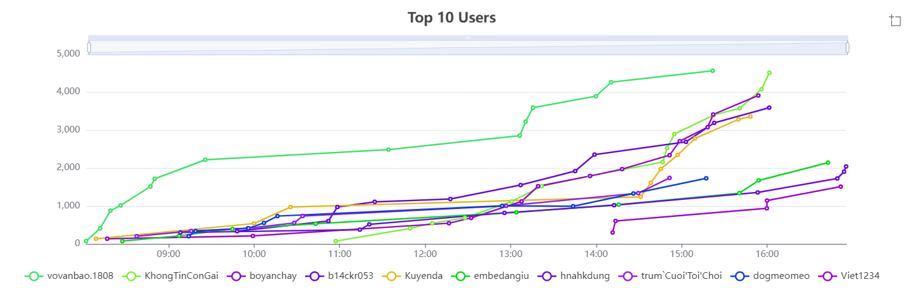
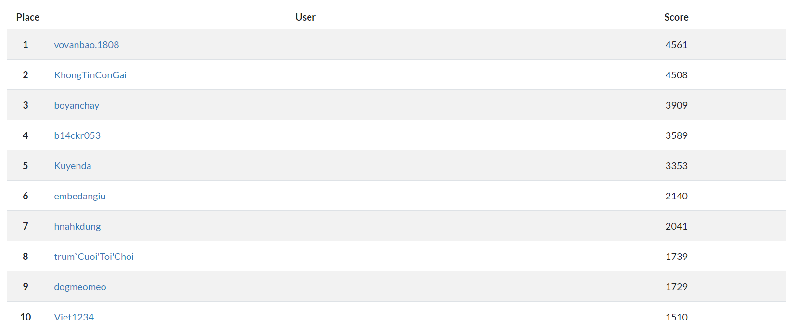
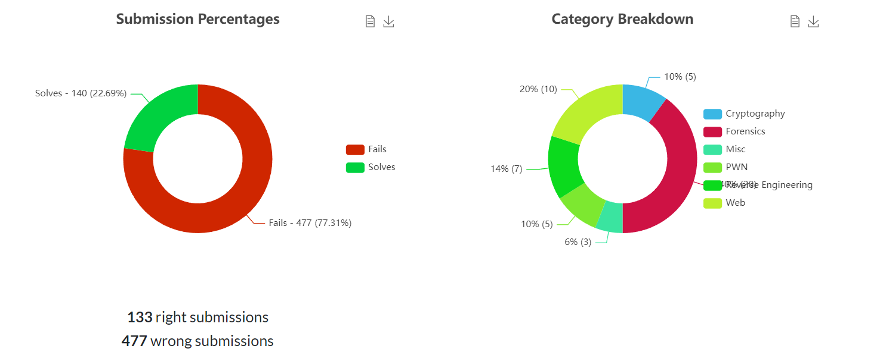

# CTF VSL 2024 March

## ![Banner][Banner]

This repository contains official **source code** and **writeups** for the majority of challenges in VKU Internal CTF Contest 2023.

---

## 👑 SCOREBOARD TOP 10 HACKER👑

- 👑 Champion: **vovanbao.1808**
- 🏅: **KhongTinConGai**
- 🏅: **boyanchay**
- 🏅: **b14ckr053**
- 🏅: **Kuyenda**

## Cryptography

| Name                                                       | Author            | Solves |
| ---------------------------------------------------------- | ----------------- | ------ |
| [Ancient Crypto](Cryptography/ancient-crypto/)             | shr3wd            | 10     |
| [Baby Encrypt](Cryptography/baby-encrypt/)                 | shr3wd            | 0      |
| [Time Travel](Cryptography/time-travel/)                   | shr3wd            | 0      |
| [Trust Uself](Cryptography/trust-urself/)                  | shr3wd            | 0      |
| [Weak RSA](Cryptography/weak-rsa/)                         | shr3wd            | 1      |

## Forensics

| Name                                                          | Author           | Solves |
| ------------------------------------------------------------- | ---------------- | ------ |
| [Disk Level 1](Forensics/DiskLevel1/)                         | lqlong           | 12     |
| [Disk Level 2](Forensics/DiskLevel2/)                         | lqlong           | 1      |
| [RAM Level 1](Forensics/RAMLevel1/)                           | lqlong           | 0      |
| [RAM Level 2](Forensics/RAMLevel2/)                           | lqlong           | 0      |
| [RAM Level 3](Forensics/RAMLevel3/)                           | lqlong           | 0      |
| [Docker Forensics 1](Forensics/Docker-Forensics/Level-1/)     | lqlong           | 6      |
| [Docker Forensics 2](Forensics/Docker-Forensics/Level-2/)     | lqlong           | 2      |
| [Logs Web Forensic 1](Forensics/Log/level-1/)                 | lqlong           | 8      |
| [Logs Web Forensic 2](Forensics/Log/level-2/)                 | lqlong           | 5      |
| [Logs Web Forensic 3](Forensics/Log/level-3/)                 | lqlong           | 5      |
| [Logs Web Forensic 4](Forensics/Log/level-4/)                 | lqlong           | 5      |
| [Logs Web Forensic 5](Forensics/Log/level-5/)                 | lqlong           | 3      |
| [Logs Web Forensic 6](Forensics/Log/level-6/)                 | lqlong           | 1      |
| [Logs Network Forensic 1](Forensics/Wireshark/level-1/)       | lqlong           | 3      |
| [Logs Network Forensic 2](Forensics/Wireshark/level-2/)       | lqlong           | 6      |
| [Logs Network Forensic 3](Forensics/Wireshark/level-3/)       | lqlong           | 3      |
| [Logs Network Forensic 4](Forensics/Wireshark/level-4/)       | lqlong           | 4      |
| [Logs Network Forensic 5](Forensics/Wireshark/level-5/)       | lqlong           | 1      |
| [Logs Network Forensic 6](Forensics/Wireshark/level-6/)       | lqlong           | 0      |
| [Logs Network Forensic 7](Forensics/Wireshark/level-7/)       | lqlong           | 0      |

## Binary Exploitation

| Name                                                       | Author            | Solves |
| ---------------------------------------------------------- | ----------------- | ------ |
| [ASM Machine](PWN/asm-machine/)                            | shr3wd            | 0      |
| [Beef Stack](PWN/beef-stack/)                              | shr3wd            | 0      |
| [Data Leak](PWN/Data-Leak/)                                | shr3wd            | 0      |
| [Newbie PWN](PWN/n3wb1e-pwn/)                              | shr3wd            | 0      |
| [Ret2Win 2](PWN/ret2win-2/)                                | shr3wd            | 0      |

## Reverse Engineer

| Name                                                       | Author           | Solves |
| ---------------------------------------------------------- | ---------------- | ------ |
| [Baby ASM](RE/baby-asm/)                                   | mrb1n            | 0      |
| [Let's GO](RE/letsgo/)                                     | mrb1n            | 0      |
| [Little Math](RE/little-math/)                             | mrb1n            | 4      |
| [Lucky Number](RE/lucky-number/)                           | mrb1n            | 0      |
| [Plus Plus In BackPack](RE/plus-in-pack/)                  | mrb1n            | 1      |
| [Security And ROID](RE/security-and-roid/)                 | mrb1n            | 0      |
| [ASCIS Warmup](RE/ASCIS-Warmup/)                           | mrb1n            | 0      |

## Web

| Name                                                       | Author           | Solves |
| ---------------------------------------------------------- | ---------------- | ------ |
| [Who Am I 1](Web/whoami1/)                                 | lqlong           | 7      |
| [Who Am I 2](Web/whoami2/)                                 | lqlong           | 0      |
| [Who Am I 3](Web/whoami-3/)                                | lqlong           | 0      |
| [LFI/RFI 1](Web/LFI-RFI-1/)                                | lqlong           | 7      |
| [LFI/RFI 2](Web/LFI-RFI-2/)                                | lqlong           | 0      |
| [Into Server 1](Web/Into-Server-1/)                        | lqlong           | 5      |
| [Into Server 2](Web/Into-Server-2/)                        | lqlong           | 0      |
| [Archive ZIP](Web/archive-zip/)                            | lqlong           | 0      |
| [Zenario](Web/zenario/)                                    | lqlong           | 0      |
| [Minecraft](Web/minecraft/)                                | lqlong           | 0      |

## Misc

| Name                                                       | Author           | Solves |
| ---------------------------------------------------------- | ---------------- | ------ |
| [Welcome Challenge](Misc/WelcomeChallenge/)                | shr3wd           | 14     |
| [Where Am I](Misc/WhereAmI/)                               | shr3wd           | 10     |
| [Catch Me If You Can](Misc/CatchMeIfYouCan/)               | shr3wd           | 9      |

---

## Conclusion

This is the first time we have organized and written CTF challenges ourselves. If there are any mistakes, please forgive them.

In the challenges, we use a number of place names and names of individual organizations to serve the competition. If there is anything that affects your individual or organization, please email us (<vkuctf@gmail.com>). Thank you!
Thank you to everyone who wrote the challenge. And we would also like to thank those who checked the challenges for us 🥰

[Banner]: https://files.catbox.moe/vw1zzo.png
